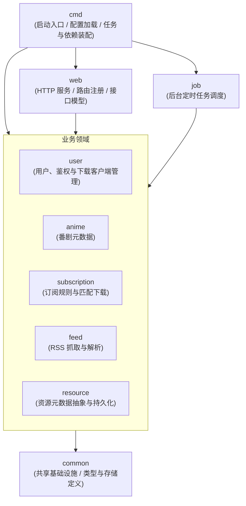
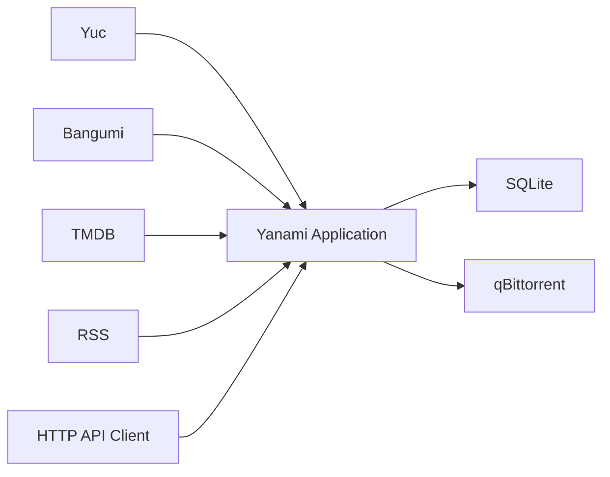

# Yanami

## 模块架构

本项目采用基于领域驱动设计（DDD）的架构，将核心业务按垂直领域（Bounded Context）划分为多个独立的 Crate：



## 运行链路



## Crate 职责

| Crate | 职责 |
| --- | --- |
| `cmd` | 程序入口、命令行解析、配置加载、全局依赖装配及后台任务初始化 |
| `web` | Web 服务器、HTTP 路由聚合、全局中间件及 API 视图模型 |
| `common` | 通用数据结构、公共基础设施（如数据库连接池、日志配置） |
| `user` | 用户实体、鉴权校验，以及下载器（如 qBittorrent）客户端管理 |
| `anime` | 番剧基础信息、核心元数据的抓取与处理领域 |
| `subscription` | 番剧订阅策略、RSS 资源与番剧的匹配分析领域 |
| `feed` | 外部 RSS 订阅源的数据拉取及结构化解析领域 |
| `resource` | 资源元数据（如 BT info_hash、磁力链接等）的抽象与持久化领域 |
| `job` | 定时任务调度框架及并发执行控制 |

## 启动

1. 复制配置模板并修改配置：
   ```bash
   cp config.toml.example config.toml
   # 按需编辑 config.toml
   ```

2. 启动服务：
   ```bash
   cargo run -p cmd -- --config config.toml
   ```

默认监听地址及端口可通过配置文件或命令行参数指定，默认启动在 `0.0.0.0:3000`。

## 配置示例

```toml
# 工作/数据目录路径
data_dir = "."

[server]
# 绑定的主机地址
host = "0.0.0.0"
# 监听的端口
port = 3000

[database]
# 数据库文件路径或连接字符串
path = "data.db"

[auth]
# 用于签发 JWT Token 的密钥 (请修改为随机字符串)
jwt_secret = "default_secret_key_change_me"
# 用于加密敏感信息的主密钥 (请修改为随机字符串)
crypto_secret = "default_crypto_secret_key_change_me"
# JWT Token 的过期时间 (单位：秒)
jwt_expire_seconds = 3600

[external]
# TMDB API 读取权限的 Token (必填，用于获取番剧元数据)
tmdb_token = "your-tmdb-token"
```

*注：部分参数也可通过命令行覆盖，如 `--host`、`--port`、`--db-path` 等。*

## 文档

| 类型 | 访问地址 |
| --- | --- |
| OpenAPI JSON | `http://127.0.0.1:3000/openapi.json` |
| ReDoc | `http://127.0.0.1:3000/redoc` |
| Swagger UI | `http://127.0.0.1:3000/swagger-ui` |

## 测试

```bash
cargo test
cargo test -p cmd
cargo test -p web
```
