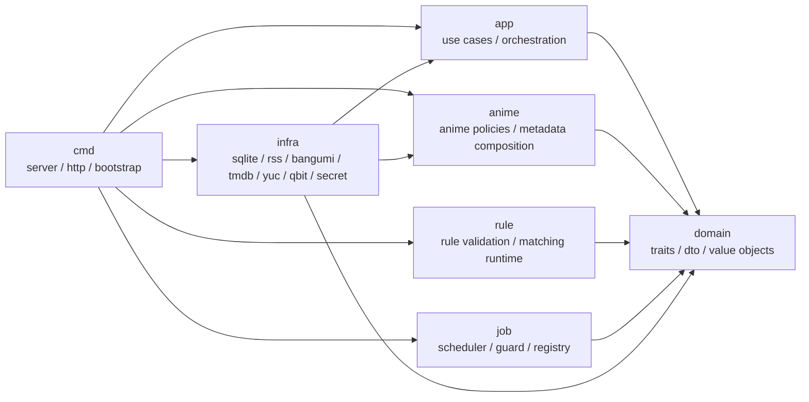
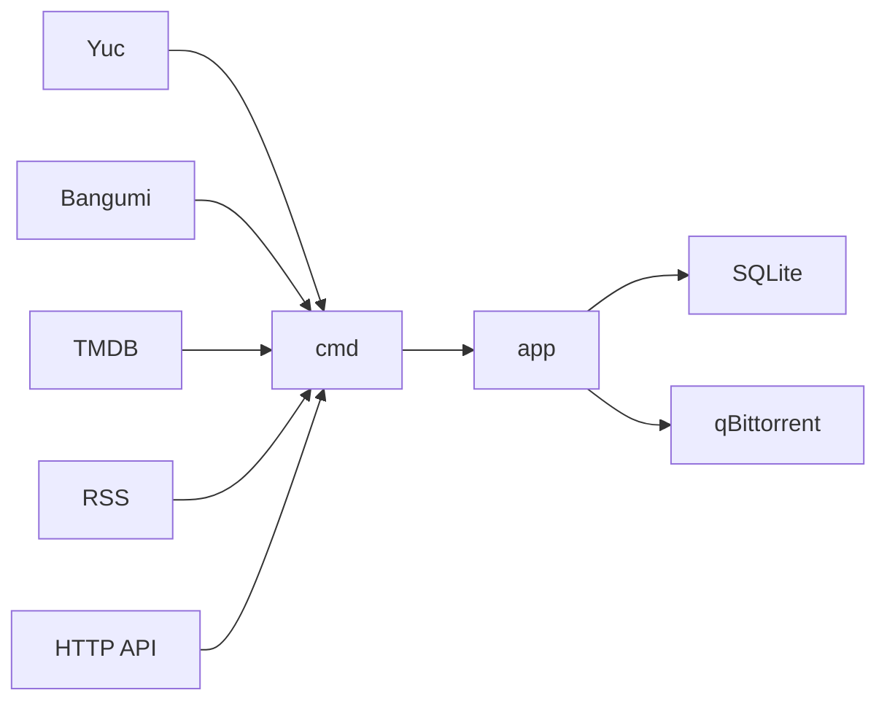

# Yanami

## 模块



## 运行链路



## Crate

| crate | 职责 |
| --- | --- |
| `domain` | 通用领域抽象、仓储 trait、数据传递模型 |
| `app` | 用例编排、聚合根入口、跨领域流程 |
| `anime` | 番剧元数据组合、订阅与缺集策略 |
| `rule` | 规则校验、规则匹配运行时 |
| `job` | 定时任务配置、调度、并发防重 |
| `infra` | SQLite、RSS、Bangumi、TMDB、Yuc、qBittorrent、密钥实现 |
| `cmd` | 配置读取、依赖装配、HTTP 服务、任务初始化 |

## 启动

```bash
cargo run -p cmd -- --config config.toml
```

默认监听地址：

```text
127.0.0.1:1234
```

## 配置

```toml
addr = "127.0.0.1:1234"
db_path = "sqlite://yanami.db?mode=rwc"
key = "replace-me"
tmdb_token = "replace-me"
mode = "info"
token_ttl_seconds = 2592000
sources = ["yuc", "bgm", "tmdb"]

[jobs.sync_anime_calendar]
enabled = true
interval_seconds = 43200

[jobs.check_missing_episodes]
enabled = true
interval_seconds = 86400

[jobs.poll_collected_releases]
enabled = true
interval_seconds = 300

[jobs.backfill_anime_subscriptions]
enabled = true
interval_seconds = 300
```

## 文档

| 类型 | 地址 |
| --- | --- |
| OpenAPI | `http://127.0.0.1:1234/openapi.json` |
| ReDoc | `http://127.0.0.1:1234/redoc` |
| Swagger UI | `http://127.0.0.1:1234/swagger-ui` |
| 架构图 | [`docs/项目架构图.md`](docs/项目架构图.md) |

## 测试

```bash
cargo test
cargo test -p cmd
cargo test -p infra
```
