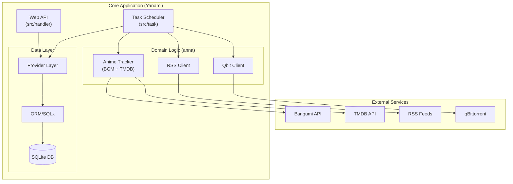
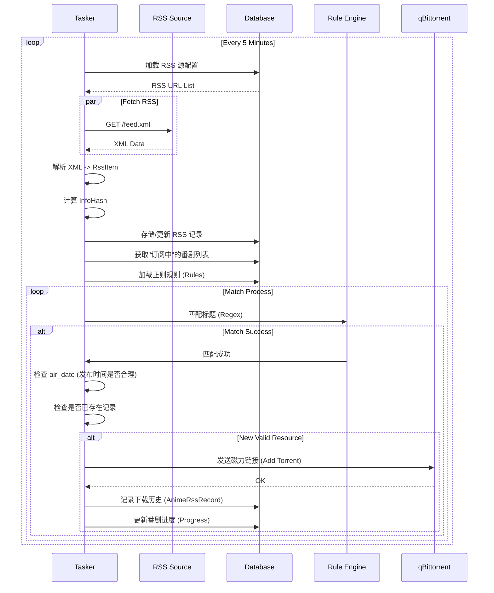

# Yanami 项目技术文档

## 1. 项目简介

**Yanami** 是一个自动化的番剧追踪与下载管理系统。它通过集成 Bangumi (番组计划) 和 TMDB 获取番剧元数据，通过 RSS 订阅获取资源发布信息，利用自定义正则表达式规则自动匹配并推送到 qBittorrent 进行下载。

### 核心功能
*   **番剧日历同步**：自动从 Bangumi 同步每日放送的番剧，并从 TMDB 补充详细的元数据（中文名、季度、集数等）。
*   **智能 RSS 订阅**：支持多 RSS 源配置，定时轮询更新。
*   **规则匹配系统**：基于正则表达式的灵活匹配规则，支持自动过滤“合集”和非当前季度资源。
*   **自动下载**：匹配成功后自动将磁力链接发送至 qBittorrent，并管理下载目录结构。
*   **Web 管理界面**：提供看板、配置管理、规则设置等可视化操作（前端资源位于 `webfile/`）。

### 技术栈
*   **语言**: Rust (Edition 2021)
*   **异步运行时**: Tokio
*   **Web 框架**: Axum (推测，基于 handler/route 结构) / Hyper
*   **数据库**: SQLite (通过 `sqlx` 访问)
*   **外部接口**: Bangumi API, TMDB API, qBittorrent API
*   **日志**: Tracing

---

## 2. 系统架构

系统采用典型的分层架构，核心业务逻辑与数据存储、外部接口分离。



### 模块职责

| Crate/目录 | 职责描述 |
| :--- | :--- |
| **src/** | 主程序入口。包含 Web 服务器启动、路由定义 (`route.rs`)、API 处理 (`handler/`) 以及核心任务调度 (`task/`)。 |
| **anna/** | **业务逻辑核心/适配器层**。封装了所有外部服务的交互逻辑，包括 BGM 日历获取、TMDB 搜索、RSS 解析、qBittorrent 客户端。 |
| **model/** | **领域模型层**。定义系统通用的数据结构（Structs），如 `AnimeInfo`, `RssItem`, `Torrent` 等。 |
| **orm/** | **数据库层**。负责数据库连接池管理、Migration 以及底层的 SQL 操作（基于 `sqlx`）。 |
| **provider/** | **数据访问层 (Repository)**。向上层提供高级的数据操作接口，屏蔽底层的数据库实现细节。 |
| **common/** | 通用工具库。包含错误处理 (`errors.rs`)、认证逻辑 (`auth.rs`) 等。 |
| **webfile/** | 前端静态资源文件（HTML/JS/CSS）。 |

---

## 3. 目录结构说明

```text
.
├── anna/               # 外部服务适配与核心逻辑
│   ├── src/
│   │   ├── anime/      # 番剧元数据处理 (Tracker)
│   │   ├── bgm/        # Bangumi API 客户端
│   │   ├── tmdb/       # TMDB API 客户端
│   │   ├── rss/        # RSS 解析客户端
│   │   └── qbit/       # qBittorrent 客户端
├── model/              # 数据模型定义 (Structs)
├── orm/                # 数据库交互 (SQLx)
├── provider/           # 数据访问抽象层 (Providers)
├── common/             # 公共工具 (Auth, Errors)
├── src/                # 应用程序入口
│   ├── handler/        # HTTP 请求处理器
│   ├── task/           # 定时任务 (Tasker)
│   ├── route.rs        # 路由配置
│   └── main.rs         # 程序入口
├── webfile/            # 前端静态资源
├── yanami.db           # SQLite 数据库文件
└── Cargo.toml          # Workspace 配置文件
```

---

## 4. 核心业务流程

### 4.1 全局任务循环 (The Loop)

`src/task/tasker.rs` 维护了两个主要的时间轮询：
1.  **日历同步 (每12小时)**: 更新番剧列表。
2.  **资源更新 (每5分钟)**: 抓取 RSS 并进行规则匹配。

### 4.2 详细数据流：从 RSS 到下载



### 4.3 番剧元数据同步流程

1.  **拉取 BGM 日历**: 获取当前及未来的番剧放送列表。
2.  **清洗名称**: 去除 "第二季"、"Season 2" 等后缀，提取核心词。
3.  **TMDB 搜索**: 使用核心词在 TMDB 搜索 (优先 zh-TW)。
4.  **关联匹配**: 通过年份、月份进行模糊匹配，确认唯一的 TMDB 条目。
5.  **补充信息**: 获取中文译名、总集数、别名列表。
6.  **持久化**: 保存 `AnimeInfo` 到数据库，作为后续 RSS 匹配的基准。

---

## 5. 数据库模型概览

虽然使用了 `sqlx`，但核心实体概念如下（基于 `model` 和代码逻辑）：

*   **AnimeInfo (番剧信息)**
    *   `id`: BGM ID
    *   `name`: 原名
    *   `name_cn`: 中文名
    *   `season`: 季度数
    *   `status`: 订阅状态 (true/false)
    *   `is_search`: 是否开启主动搜索
*   **RssRecord (RSS 记录)**
    *   `magnet`: 磁力链接
    *   `info_hash`: 唯一标识
    *   `source`: 来源 (RSS 标题)
*   **Rule (规则)**
    *   `re`: 正则表达式字符串
    *   `cost`: 优先级/权重
*   **AnimeRssRecord (下载历史)**
    *   关联 `anime_id` 和 `info_hash`，用于去重和进度统计。

```